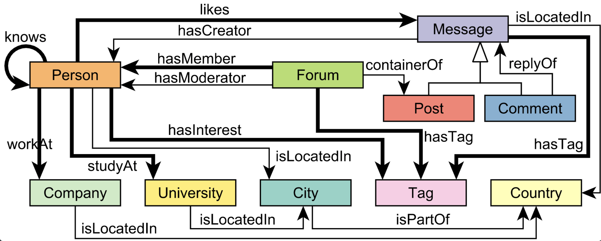

# TigerGraph demo on a cluster
## Introduction
TigerGraph has two modes:
1. Non-distributed mode: the data is gethered at the local node. This mode targets for transaction workload (low latency for small query). 
2. Distributed mode: query is executed on all the nodes in parallel. This mode targets for analytical workload (large query that touch a large amount of data).

## Data schema and statistics

1T data: ~2.5 B vertices and ~11 B edges
| Comment  | Post | Person | Forum |
|-------|-------|-------|-------|
|1,876,785,283| 519,738,978 |  3,399,580 | 33,168,124 |

10T data: ~25 B vertices and ~110 B edges
| Comment  | Post | Person | Forum |
|-------|-------|-------|-------| 
|18,880,439,325| 4,461,342,990 |  26,384,952 | 257,338,738 |

## Results
### 1T LDBC SNB data
#### Environment
- 4x GCP n2d-highmem-64 
- Each machine has 64vCPU/512G RAM
- TigerGraph 3.7.0-RC

#### Latency (in millisecond)
IS6: 
|CNT    |P50    |P90    |P95    |P99    |
|-------|-------|-------|-------|-------|
|500    |28.89  |32.54  |34.02  |42.59  |

IS6 with EDGE*: 
|CNT    |P50    |P90    |P95    |P99    |
|-------|-------|-------|-------|-------|
|500    |209.66 |220.83 |224.14 |239.86 |

IS6 distributed: 
|CNT    |P50    |P90    |P95    |P99    |
|-------|-------|-------|-------|-------|
|500    |657.31 |666.47 |856.46 |858.67 |

IS2: 
|CNT    |P50    |P90    |P95    |P99    |
|-------|-------|-------|-------|-------|
|500    |41.18  |51.47  |55.61  |63.58  |

IS2 with EDGE*: 
|CNT    |P50    |P90    |P95    |P99    |
|-------|-------|-------|-------|-------|
|500    |440.39 |469.57 |480.02 |578.58 |

IS2 distributed: 
|CNT    |P50    |P90    |P95    |P99    |
|-------|-------|-------|-------|-------|
|500    |937.36 |1080.41        |1126.93        |1192.10        |

### 10T LDBC SNB data
#### Environment 
- 20x GCP n2d-highmem-96 
- Each machine has 96vCPU/768G RAM
- TigerGraph 3.7.0-RC

#### Latency (in millisecond)
IS6: 
|CNT	|P50	|P90	|P95	|P99	|
|-------|-------|-------|-------|-------|
|500	|143.71	|238.34	|337.12	|361.11	|

IS6 with EDGE*: 
|CNT	|P50	|P90	|P95	|P99	|
|-------|-------|-------|-------|-------|
|500	|1082.86	|1297.22	|1349.62	|1454.78	|

IS6 distributed:
|CNT	|P50	|P90	|P95	|P99	|
|-------|-------|-------|-------|-------|
|500	|1446.91	|1482.30	|1505.32	|1685.49	|

IS2: 
|CNT	|P50	|P90	|P95	|P99	|
|-------|-------|-------|-------|-------|
|500	|183.10	|338.74	|364.00	|403.50	|
